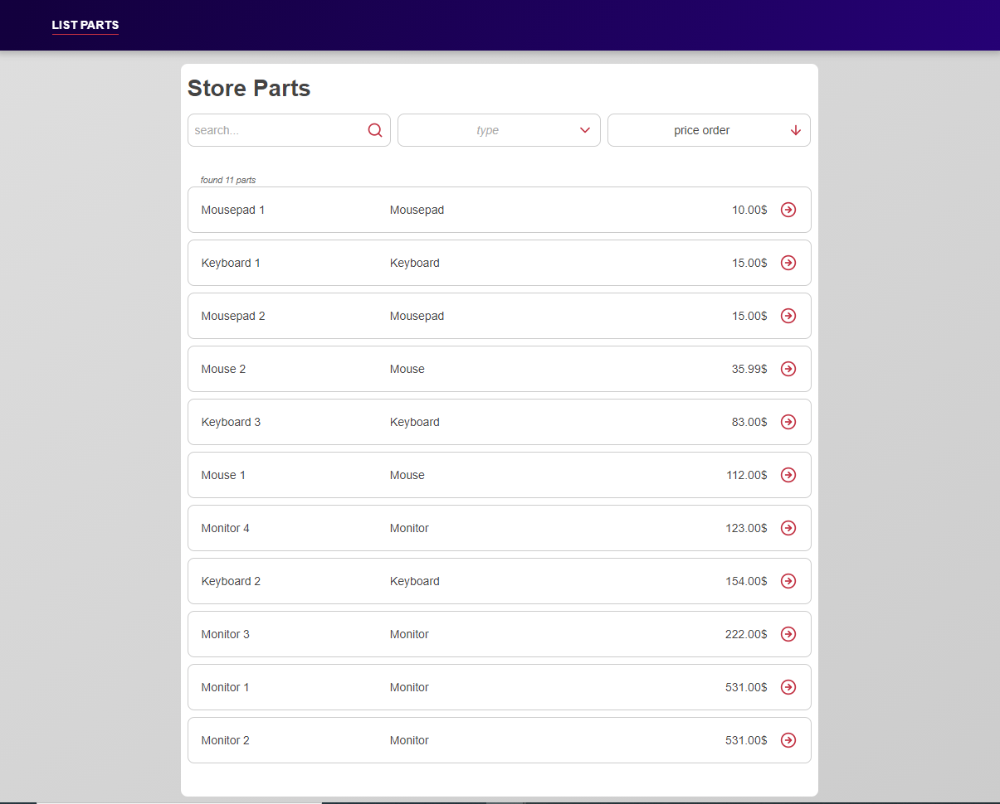

<div align="center">
  
</div>

# STORE-PARTS-EXERCISE

This project was bootstrapped with [Create React App](https://github.com/facebook/create-react-app).

The follow tasks are completed:

[x] Two different routes

- two routes: the "/" to present the list of parts and the "/show" to present only one part.

[x] The possibility to order by price implemented on the SPA side

[x] A way to request different parts by type

- using a combobox to select which type to filter the list wihtout a request to the API.

[x] The ability to request different search queries on typing

[x] Static typing

- using Typescript

[x] Eslint

## Instal, configure and run

To install the dependencies:

```shell
yarn

# or

npm install
```

Before start the aplication, create a file `.env.local` with:

```
REACT_APP_API_URL=http://localhost:8081
```

Runs the app in the development mode.

```shell
yarn start

# or

npm start
```

Open [http://localhost:3000](http://localhost:3000) to view it in the browser.

## Test (not completed)

```shell
yarn test

# or

npm run test

```

## License

MIT © mourabraz@hotmail.com
